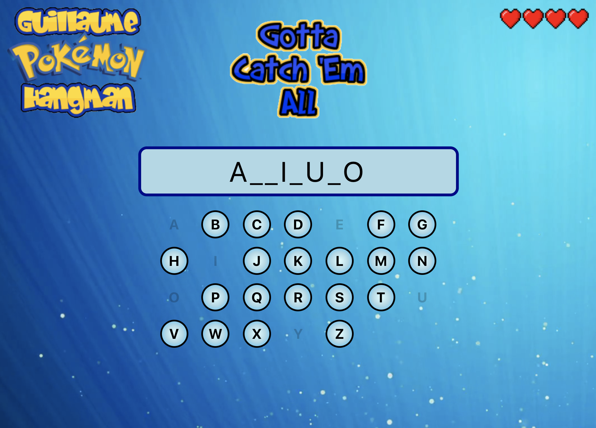
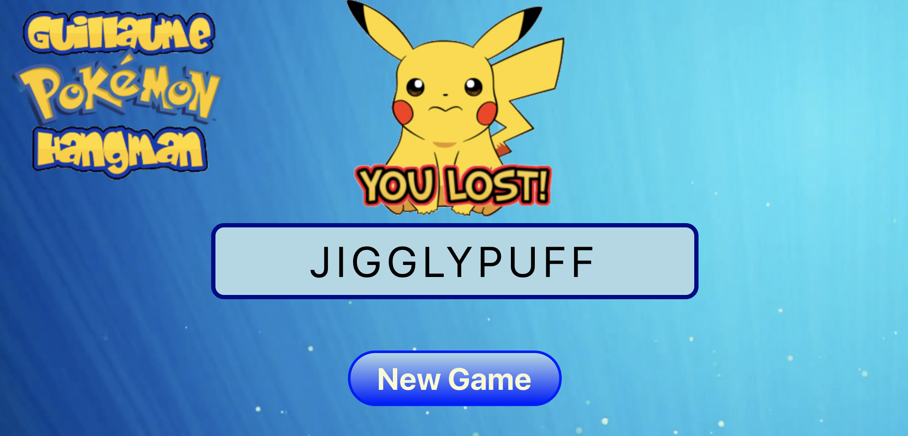
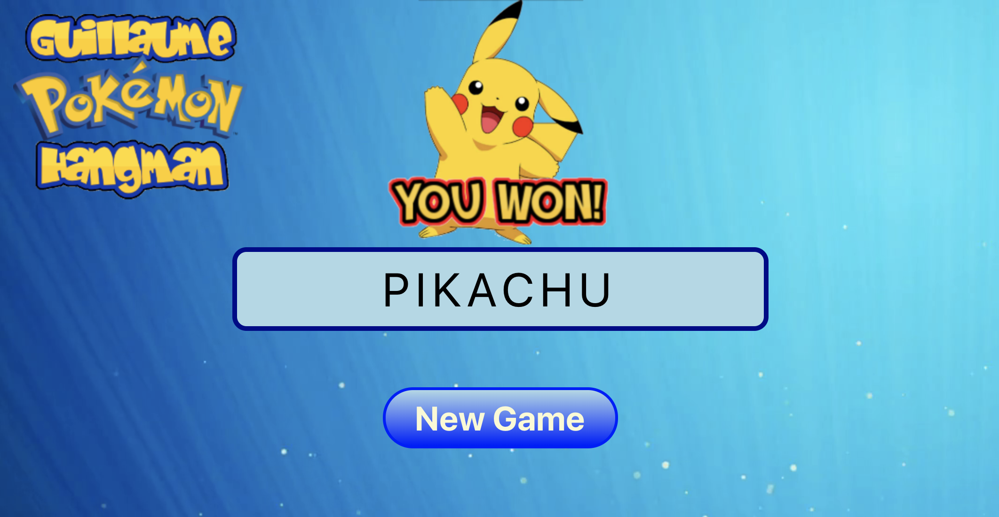

:space_invader: Guillaume's Pokemon Hangman :space_invader:
===

Main functionalities:
- The game chooses a ramdom name within the list of first generation pokemon names.
- The player has 6 lives at initial state and will select letters to play.
- If a correct letter is guessed, it shows within the visual progress and no life is lost.
- If no correct letter is guessed, a life is lost.
- The game logic prohibits a player from selecting a letter twice.
- If the playear loses his 6 lives the game is lost.
- if the player guesses the Pokemon name before losing all his lives, the game is won.
- A new game can be started at anytime.

Technologies used:
----
- JavaScript
- ES6 syntax
- create-react-app
- React
- React-Dom
- PropTypes
- Redux
- React-redux
- lodash
- classNames
- BEM
- CSS
- Jest
- png images
- Github pages

Desktop preview:
----








Tests preview:
----


How to run it:
----
- General Use:
```
git clone git@github.com:GBouffard/pokemon-hangman.git
cd pokemon-hangman

npm install
npm test
npm start
```

Deployment link (Github Pages):
----
[Guillaume's Pokemon Hangman](https://gbouffard.github.io/pokemon-hangman/)


Methodology:
----
- I first scaffolded the app through react-create-app.
- I started with unit logic tests and based the game logic on how it is supposed to work. It was suggested not to worry about test but I see unit testing as a very important part of a project; it's an absolute guarantee that the logic of the app does what it's supposed to do.
- I then started creating the user interface through React and the code is gearing towards re-usability and possible extensions.
- I finally integrated the whole logic and components with the state through Redux and React-redux.
- I deployed using Github pages